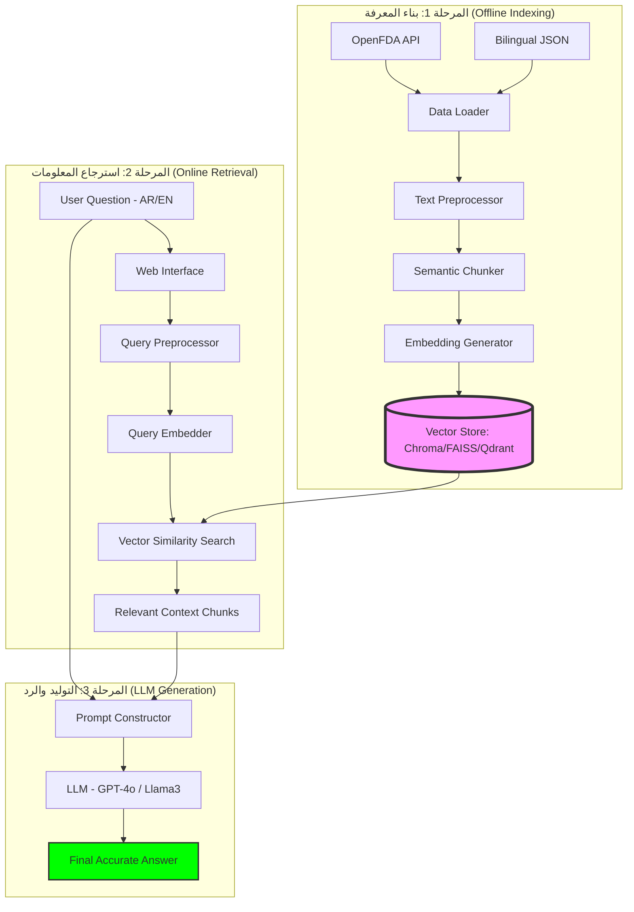

# 💊 Pharmaceutical Drug Information Assistant using RAG (Comparative Study)

هذا المستند يقدم نظرة عميقة على المكونات التقنية وآلية عمل نظام استرجاع المعلومات الصيدلانية المدعم بالتوليد، والمصمم كدراسة مقارنة بين نماذج اللغة الكبيرة (LLMs) وتقنيات الاسترجاع المختلفة.

---

## � أهداف المشروع (Project Objectives)

يهدف هذا المشروع إلى معالجة مشكلة "الهلوسة" في نماذج اللغة الكبيرة عند التعامل مع المعلومات الطبية الحساسة من خلال:
1.  **تقليل الهلوسة:** ربط الإجابات بمصادر موثوقة (OpenFDA).
2.  **دراسة مقارنة:** تقييم أداء النماذج السحابية (GPT-4o) مقابل النماذج المحلية (Ollama).
3.  **تحسين الاسترجاع:** مقارنة تأثير قواعد البيانات الشعاعية المختلفة (ChromaDB, FAISS, Qdrant) ونماذج التضمين (Embeddings) على جودة النتائج.

---

## �🏗️ البنية التحتية للمشروع (System Architecture)

يعتمد النظام على هيكلية **RAG (Retrieval-Augmented Generation)** متطورة. يعمل النظام من خلال مراحل أساسية تضمن دقة الإجابة الطبية.

### 📉 رسم بياني شامل لآلية العمل (End-to-End Workflow)

---

## 🔍 شرح المكونات (Component Breakdown)

### **1. محرك البيانات (Data Loader)**
يعتمد على **openFDA API** كمصدر أساسي للبيانات الرسمية والمحدثة، مع دعم محلي للغة العربية عبر ملفات JSON.

### **2. معالج النصوص (Text Preprocessor)**
يدعم اللغتين العربية والإنجليزية، ويستخدم `PyArabic` لمعالجة النصوص العربية، مع تقنية Chunks بحجم 500 كلمة وتداخل 10%.

### **3. مولد التضمينات (Embedding Generator)**
يدعم خيارين للبحث الدلالي:
-   **Ollama:** نموذج `nomic-embed-text` (للخصوصية والأداء المحلي).
-   **OpenAI:** نماذج `text-embedding-3-small` (للدقة والسرعة السحابية).

### **4. قواعد البيانات الشعاعية (Vector Stores)**
يدعم النظام المقارنة بين:
-   **ChromaDB:** (مفعل حالياً) للتخزين المستمر والسهولة.
-   **FAISS & Qdrant:** (قيد التطوير) للمقارنة المذكورة في البروبوزال.

### **5. واجهة الربط مع النماذج (LLM Integration)**
تدعم التبديل الديناميكي بين **Ollama (Llama3)** و **OpenAI (GPT-4o)** لتقييم الفروقات في الدقة والموثوقية.

---

## 📊 خطة التقييم (Evaluation Plan)

يعتمد المشروع على إطار عمل **RAGAS** للتقييم من خلال ثلاثة معايير أساسية:
1.  **Context Relevance:** مدى صلة المعلومات المسترجعة بالسؤال.
2.  **Faithfulness:** مدى التزام النموذج بالمعلومات المسترجعة (تجنب الهلوسة).
3.  **Answer Relevance:** مدى إجابة الرد النهائي على سؤال المستخدم.

بالإضافة إلى قياس **زمن الاستجابة (Latency)** و**الدقة الطبية (Medical Validation)**.
