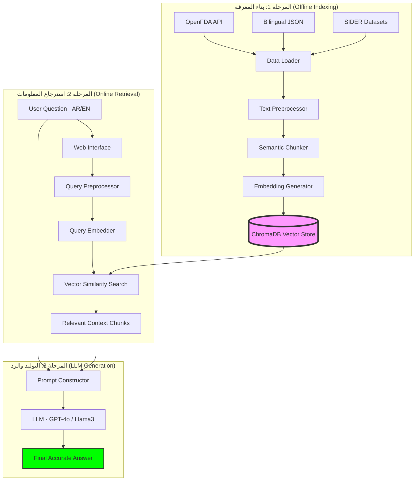

# 💊 شرح تقني مفصل لنظام Pharmaceutical RAG (ثنائي اللغة)

هذا المستند يقدم نظرة عميقة على المكونات التقنية وآلية عمل نظام استرجاع المعلومات الصيدلانية المدعم بالتوليد.

---

## 🏗️ البنية التحتية للمشروع (System Architecture)

يعتمد النظام على هيكلية **RAG (Retrieval-Augmented Generation)** متطورة تربط بين البيانات الطبية الرسمية وقدرات التوليد اللغوي. يعمل النظام من خلال ثلاث مراحل أساسية تضمن دقة الإجابة الطبية.

### 📉 رسم بياني شامل لآلية العمل (End-to-End Workflow)

---

## 🔍 شرح المكونات (Component Breakdown)

### **1. محرك البيانات (Data Loader)**
يوجد في ملف [data_loader.py](src/data_loader.py). تم ضبط هذا المحرك ليعتمد على التراتبية التالية لضمان دقة المعلومات:
-   **المصدر الأساسي (Primary):** **openFDA API** - يتم جلب البيانات الرسمية والمحدثة مباشرة من منظمة الغذاء والدواء الأمريكية.
-   **المصدر الثانوي (Fallback):** **Bilingual JSON** - قاعدة بيانات محلية مخصصة لدعم اللغة العربية وتوفير ترجمة دقيقة للأدوية الشائعة.
-   **توحيد التنسيق:** يتم تحويل جميع البيانات إلى تنسيق موحد يطابق هيكلية السجلات الرسمية (Indications, Dosage, Side Effects, Warnings) لضمان اتساق الإجابات.

### **2. معالج النصوص (Text Preprocessor)**
يوجد في ملف [text_preprocessor.py](src/text_preprocessor.py). يعالج النصوص بطريقة تناسب اللغتين:
-   **العربية:** توحيد الألف والتاء المربوطة وإزالة التشكيل (Tashkeel) باستخدام مكتبة `PyArabic`.
-   **الإنجليزية:** تحويل للنص الصغير (Lowercase) وتنظيف الحروف الخاصة.
-   **التجزئة (Chunking):** تقسيم النصوص إلى أجزاء (Chunks) بحجم 500 كلمة مع تداخل (Overlap) بنسبة 10% لضمان عدم ضياع سياق المعلومات.

### **3. مولد التضمينات (Embedding Generator)**
يوجد في ملف [embedding_generator.py](src/embedding_generator.py). يدعم النظام خيارين:
-   **Ollama (محلي):** يستخدم نموذج `nomic-embed-text` للخصوصية التامة.
-   **OpenAI (سحابي):** يستخدم نماذج مثل `text-embedding-3-small` لسرعة فائقة (ثوانٍ بدلاً من ساعات).
يمكن التبديل بينهما عبر إعداد `EMBEDDING_PROVIDER` في ملف `.env`.

### **4. قاعدة البيانات الشعاعية (Vector Store)**
يوجد في ملف [vector_store.py](src/vector_store.py). نستخدم **ChromaDB**:
-   قاعدة بيانات شعاعية (Vector Database) متطورة تدعم التخزين المستمر (Persistent Storage).
-   تسهل عملية البحث عن المعلومات ذات الصلة وربطها بالاستفسارات.
-   تُخزن البيانات في مجلد `chroma_db` في المجلد الرئيسي للمشروع.

### **5. واجهة الربط مع النماذج (LLM Integration)**
توجد في ملف [llm_integration.py](src/llm_integration.py). تدعم:
-   **Ollama:** نماذج محلية مثل `llama3` أو `mistral`.
-   **OpenAI:** نماذج GPT السحابية.
-   **تلقائية اللغة:** تم تصميم الـ Prompt ليفهم لغة السؤال ويجيب بنفس اللغة تلقائياً.
يمكن التبديل بينهما عبر إعداد `LLM_PROVIDER` في ملف `.env`.

### **6. واجهة المستخدم (UI/Frontend)**
تم تطوير واجهة مستخدم ويب حديثة باستخدام:
-   **Backend:** Flask لخدمة الطلبات وربطها بمحرك RAG.
-   **Frontend:** HTML5, CSS3 (مع نظام ألوان طبي احترافي), و JavaScript للتعامل مع API بشكل متزامن.
-   **تجربة المستخدم:** دعم كامل للكتابة من اليمين لليسار (RTL) للغة العربية، وتنسيق الإجابات الطبية بشكل مريح للعين.

---

## ⚙️ الإعدادات المركزية (Centralized Config)

يتم التحكم في كل شيء من خلال ملف [config.py](src/config.py) وقراءة القيم من ملف **[.env](.env)**:
-   `LLM_PROVIDER`: التبديل بين `openai` و `ollama`.
-   `EMBEDDING_PROVIDER`: التبديل بين `openai` و `ollama`.
-   `DRUG_API_URL`: رابط مصدر البيانات (API).
-   `OPENAI_API_KEY`: مفتاح OpenAI.
-   `CHUNK_SIZE`: حجم الأجزاء النصية.

---

## 💡 لماذا هذا النظام "مستوى إنتاج" (Production Level)؟
1.  **الخصوصية:** يعمل محلياً بالكامل عبر Ollama.
2.  **الدقة:** يستخدم تقنيات متقدمة لمعالجة اللغة العربية.
3.  **المرونة:** سهولة تبديل النماذج أو قواعد البيانات.
4.  **الأداء:** البحث الشعاعي عبر **ChromaDB** يضمن سرعة استرجاع عالية ودقة في فهم المعنى الدلالي.
5.  **التوثيق:** وجود نظام تسجيل أحداث (Logs) شامل لمراقبة العمليات واكتشاف الأخطاء فورياً.
6.  **تعدد اللغات:** دعم حقيقي وشامل للغتين العربية والإنجليزية في كل مراحل النظام.
